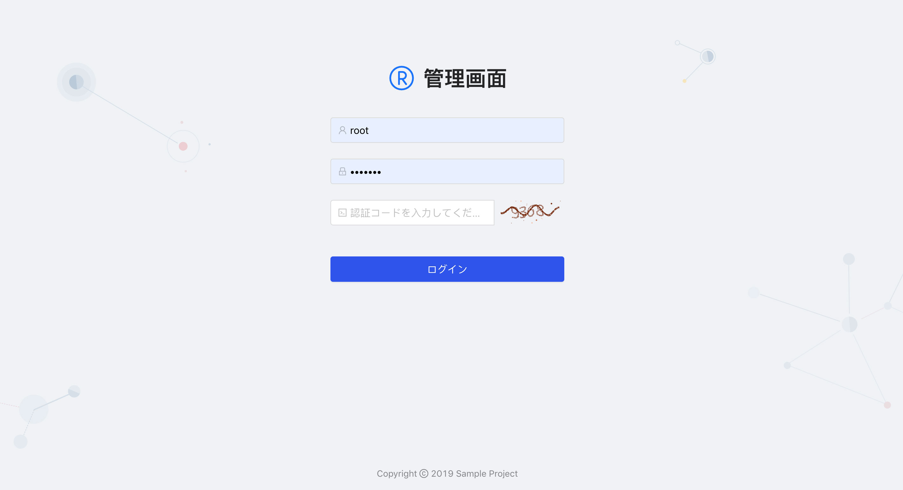
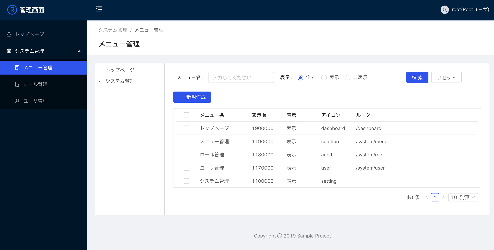

<h1 align="center">gin-admin-with-frontend-sample</h1>

<div align="center">
 `gin-admin-cli new -d ./gin-admin-with-frontend-sample -w`で作成したものです<br>
 画面表示を日本語化しています
</div>

<div align="center">
    <br>
    
</div>

### フロントエンド起動

```bash
$ cd gin-admin-with-frontend-sample/web
$ yarn install
$ yarn start
```

### バックエンド起動

```bash
$ cd gin-admin-with-frontend-sample
$ make start
```

### 初期ログインID
+ ID: root
+ PW: abc-123

### リンク
+ [https://github.com/LyricTian/gin-admin](https://github.com/LyricTian/gin-admin)
+ [https://github.com/LyricTian/gin-admin-react](https://github.com/LyricTian/gin-admin-react)
+ [https://github.com/LyricTian/gin-admin-cli](https://github.com/LyricTian/gin-admin-cli)
